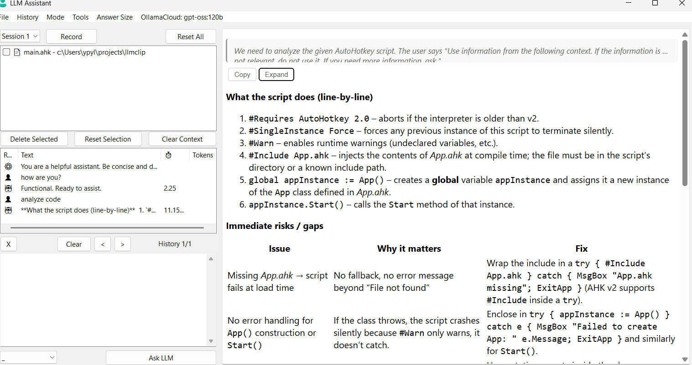

# LLMClip

An AutoHotkey v2 clipboard manager that transforms your clipboard history into context for LLM conversations.



## Overview

LLMClip monitors your clipboard and aggregates copied text, files, and folders into a unified context for AI chat. Your clipboard history becomes a dynamic knowledge base for your LLM assistant.

## Features

- **Clipboard Monitoring**: Toggle recording via hotkey (F3) or tray menu
- **Smart Parsing**: Auto-captures text, file paths, and folder contents; avoids duplicates
- **Context Selection**: Click to preview items, Ctrl+Click to select multiple for focused queries
- **Multi-Provider Support**: Works with Groq, Google, Ollama, and GitHub Models (configurable via `settings.json`)
- **Session Management**: Organize conversations into separate sessions
- **Message Regeneration**: Select any user message and regenerate from that point
- **Message Editing**: Edit previous messages and regenerate responses
- **Tool Integration**: LLM can execute PowerShell commands and file operations (read/write/delete)
- **Markdown Rendering**: Interactive responses with copy buttons for code blocks
- **One-Click Tool Execution**: Run LLM-suggested tool calls with a single button

## Installation

1. Install [AutoHotkey v2](https://www.autohotkey.com/download/)
2. Install cURL: `winget install cURL.cURL` or download from [curl.se](https://curl.se/download.html)
3. Clone/download this repository
4. Create `settings.json` (see example below)
5. Run `clip.ahk`

## Usage

### Hotkeys
- **F3**: Cycle through Start Recording → Show UI → Stop Recording
- **Enter**: Send message (in prompt)
- **Shift+Enter**: New line (in prompt)

### Tray Menu
- **Left-click**: Toggle clipboard recording
- **Right-click**: Access full menu (Start/Stop Recording, Ask LLM, Exit)

### Interface

**Left Panel:**
- Session dropdown
- Context list (clipboard history)
- Chat history (click messages to view/interact)
- Prompt area with tool toggles and answer length selector

**Right Panel:**
- Displays selected content (context items, messages, LLM responses)

### Regeneration & Editing
1. **Regenerate**: Select a user message, leave prompt empty, click "Ask LLM"
2. **Edit & Regenerate**: Select a user message, edit in prompt box, click "Ask LLM"

## Configuration

Create `settings.json` with your API keys:

```json
{
    "selectedLLMType": "groq",
    "providers": {
        "groq": {
            "curl": "curl -s -S -X POST \"https://api.groq.com/openai/v1/chat/completions\" -H \"Content-Type: application/json\" -H \"Authorization: Bearer <<KEY>>\" -d \"@{1}\" -o \"{2}\"",
            "model": "llama-3.3-70b-versatile",
            "temperature": 0.7,
            "system_prompt": "You are a helpful assistant. Be concise and direct in your responses."
        },
        "ollama": {
            "curl": "curl -s -S -X POST \"http://localhost:11434/api/chat\" -H \"Content-Type: application/json\" -H \"Authorization: Bearer <<KEY>>\" -d \"@{1}\" -o \"{2}\"",
            "model": "llama3",
            "temperature": 0.7,
            "system_prompt": "You are a helpful assistant. Be concise and direct in your responses."
        }
    }
}
```

Replace `<<KEY>>` with your actual API keys.

## License

MIT License

## Credits

Uses libraries from [thqby/ahk2_lib](https://github.com/thqby/ahk2_lib)