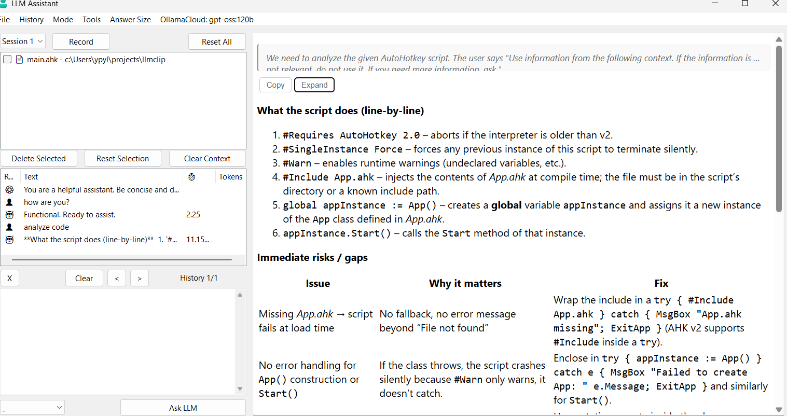

# LLMClip

An AutoHotkey v2 clipboard manager that transforms your clipboard history into context for LLM conversations.



## Overview

LLMClip monitors your clipboard and aggregates copied text, files, and folders into a unified context for AI chat. It seamlessly integrates with various LLM providers (Groq, Ollama, Google Gemini, OpenAI) to allow you to chat with your clipboard content.

## Features

### 📋 Clipboard Monitoring & Context Management
- **Smart Capture**: Automatically captures copied text, file paths, and folder contents.
- **Context Awareness**:
    - **Files & Folders**: Reads content of text-based files and lists folder contents.
    - **Images**: Supports clipboard images and image files for multimodal LLMs.
    - **URLs**: Extracts content and metadata from web links.
- **Selection Control**: Checkboxes allow you to select specific items from your history to send as context.

### 🤖 LLM Integration
- **Multi-Provider**: Pre-configured support for **Groq**, **Ollama**, **Google (Gemini)**, and **OpenAI**.
- **Customizable**: Flexible configuration via `providers/` and `prompts/` directories for models and behavior.
- **Tools**: Allow models to execute terminal commands on your system for file system operations, reading context, and running scripts when enabled. Available tools include:
    - `web_search`: Perform a web search to get the latest information.
    - `web_fetch`: Read the content of a specific web page by URL.
    - `read_url_markdown`: Cleanly convert web pages to Markdown.
    - `execute_powershell`: Execute PowerShell scripts for system operations.
    - `file_system`: Perform local file read, write, and list operations.

### 💬 Advanced Chat Interface
- **Markdown Rendering**: chat history is rendered with Markdown, including syntax highlighting for code blocks.
    - **Mermaid Diagrams**: Supports rendering of Mermaid diagrams for visual workflows and charts.
    - **Save as SVG**: Save generated diagrams directly from the chat interface.
- **History Management**:
    - **Compression**: "Compress" feature to summarize long conversations and save tokens.
    - **Extract Notes**: "Extract Learnings" to summarize key information from a session.
    - **Branching**: Double-click any previous **user** message to create a new history branch (timeline). This populates the input box with the message text for editing and regeneration.
- **Session Management**: Switch between multiple independent chat sessions.

## Installation

1.  **Install AutoHotkey v2**: Download from [autohotkey.com](https://www.autohotkey.com/).
2.  **Install cURL**: Ensure `curl` is installed (`winget install cURL.cURL` or via [curl.se](https://curl.se/)).
3.  **Clone Repository**: Clone or download this project.
4.  **Configuration**: 
    - Create a `keys.ini` file for your API keys.
    - (Optional) Customize files in `providers/` and `prompts/` directories.
5.  **Run**: Execute `main.ahk`.

## Configuration

### API Keys (`keys.ini`)

Create a file named `keys.ini` inside the root directory. Use the following format:

```ini
[GitHub]
api_key=your_github_token_here

[Groq]
api_key=your_groq_api_key_here

[GroqAudio]
api_key=your_groq_audio_api_key_here

[Google]
api_key=your_google_gemini_api_key_here

[OllamaCloud]
api_key=your_ollama_cloud_api_key_here

[OpenRouter]
api_key=your_openrouter_api_key_here
```

The key name (e.g., `groq`) should match the provider name defined in your configuration.

### Advanced Configuration

- **`providers/`**: Folder containing multiple JSON files to define LLM endpoints, models, and curl commands. They are combined at runtime.
- **`prompts/`**: Folder containing multiple JSON files to store your reusable system prompts (e.g. `_init.json`). They are combined at runtime.

## Usage

### Hotkeys
- **F3**: Toggle Recording / Show Window / Stop Recording cycle.
- **Enter**: Send message.
- **Shift+Enter**: Insert newline.

### Interface Tips
- **Context List**: Uncheck items you don't want to send to the LLM.
- **Images**: If an image is in the clipboard or selected context, it will be sent to multimodal models (like Gemini or GPT-4o).
- **Tools**: Enable tools to allow the LLM to write and execute commands on your system (Use with caution!).

## Architecture

This project strictly separates UI, logic, intent, and state domains:
- **`main.ahk`**: Composition root bringing the app components together.
- **`ui/` (Views)**: Manages UI creation and events. Zero logic and state.
- **`controllers/`**: Isolates and owns the UI state. Receives UI events and executes commands.
- **`commands/`**: Represents distinct use-cases mutating application state. No UI.
- **`services/`**: Application state owners and pure UI-agnostic logic.

Read the exhaustive architectural guidelines in [ARCHITECTURE.md](./ARCHITECTURE.md).

## License

MIT License

## Credits

Uses libraries from [thqby/ahk2_lib](https://github.com/thqby/ahk2_lib)